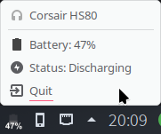

# hs80tray

Tray indicator for Corsair HS80 Headset



## Features

- Battery level
- Charging state

## Installing

```bash
git clone https://github.com/robertoszek/hs80tray.git
cd hs80tray
cmake .
make
sudo make install
```

Create the file `/etc/udev/rules.d/corsair-hid.rules` with the following contents:
```
SUBSYSTEM=="hidraw", ATTRS{idVendor}=="1b1c", ATTRS{idProduct}=="0a73", MODE="0666"
```

## Running
```bash
$ hs80tray
```

## Usage

```bash
$ hs80tray -h
Usage: hs80tray [options]
Show a battery indicator on the system tray for Corsair HS80 headsetOptions:
  -h, --help      Show this help message
  -v, --verbose   Enable verbose debug output
```

#### WIP
Only gets the messages the headset reports back, so it takes a while to display the battery percentage for the first time.

Still trying to decode the captured data between iCUE and the Wireless Receiver, in order to request status report directly instead of waiting for the headset to report by itself a change of state.
